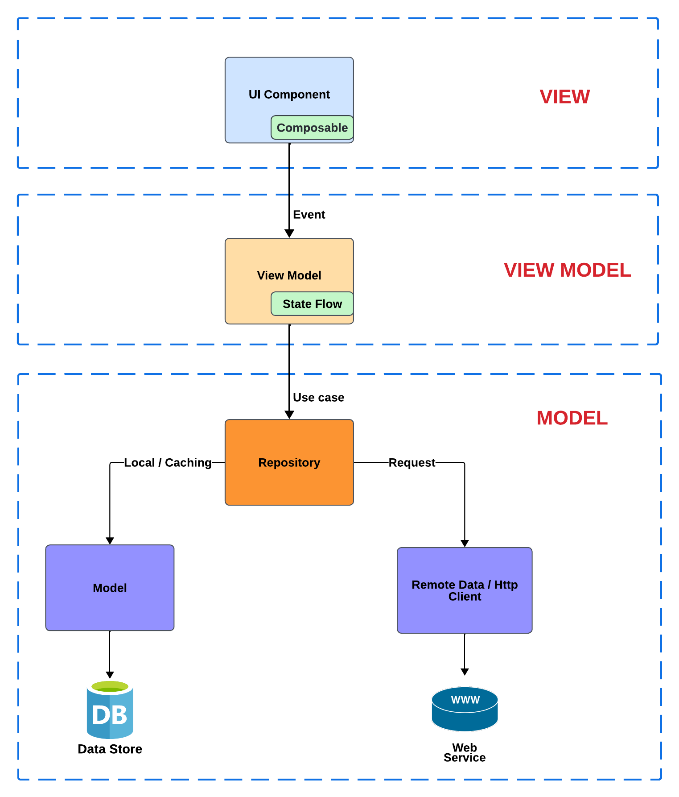

# Github User Management App

The GitHub user management app is a demo project to demonstrate the ability to implement mobile apps
natively for Android & iOS by using the latest technology, architecture with **Kotlin and Compose Multiplatform**!

## 📷 Quick Preview

- [iOS](https://drive.google.com/file/d/1foL3jDXQG2Lqxx8PFBNJA4KrazXhFPdW/view?usp=drive_link)
- [Android](https://drive.google.com/file/d/1IO0A0XGOBS2gNsmJO_1AVPTXZJ9RlCWZ/view?usp=drive_link )

## 🔧 Installation

1. Clone this repository:  `git clone https://github.com/trexnguyen28/github-user-management`
2. Open in the latest version of Android Studio or Intellij idea.
3. Before running the project, obtain an Github API token
   from [Github](https://docs.github.com/en/authentication/keeping-your-account-and-data-secure/managing-your-personal-access-tokens) .
4. Change `const val API_TOKEN = ""` by your token
5. For Android, run the `composeApp` module by selecting the `app` configuration. If you need help
   with the configuration, follow this link
   for [android](https://www.jetbrains.com/help/kotlin-multiplatform-dev/compose-multiplatform-create-first-app.html#run-your-application-on-android)
6. For iOS, run the `composeApp` module by selecting the `iosApp` configuration. If you need help
   with the configuration, follow this link
   for [Ios](https://www.jetbrains.com/help/kotlin-multiplatform-dev/compose-multiplatform-create-first-app.html#run-your-application-on-ios)

## 🧑🏻‍💻 Tech stack

- Application entirely written in [Kotlin](https://kotlinlang.org)
- UI developed entirely
  in [Compose Multiplatform](https://www.jetbrains.com/lp/compose-multiplatform/)
- UI Tests
  with [Compose Multiplatform UI Testing](https://www.jetbrains.com/help/kotlin-multiplatform-dev/compose-test.html)
- Component-based navigation with [Voyager](https://voyager.adriel.cafe/)
- Dependency injection with [Koin](https://insert-koin.io)
- Network request with [Ktor Client](https://github.com/ktorio/ktor)
- Data store persistence (Offline mode)
  with [Kotlin DataStore](https://developer.android.com/kotlin/multiplatform/datastore)
- Image caching with [Coil](https://coil-kt.github.io/coil/)

## 📖 Project Struture

Let's take a look in project structure inside the **commonMain** folder:

* **ui** - The folder containing all the UI components and their View Model for whole application.
  Currently we have `MainScreen` and `DetailScreen`.
* **di** - The folder containing all DI module follwing the _dependency  
  inversion_ concept by **Koin**. Currently we
  have `networkModule` , `dataModule` `viewModelMoudle`.
* **data** - The folder containing the data definition and their handling logic
  including `model`, `repository`, `cachingStore`
* **client** - The folder containing the handling logic related to networking requests such
  as `GithubUserClient`
* **utitls** - The foloder containing the helpers, utils logic

## 🏛 App Architecture

The app architecture is based on
the [MVVM](https://developer.android.com/topic/libraries/architecture/viewmodel) architecture
officially supported by Android developer community. We also relies on some core principles such
as [SOC](https://en.wikipedia.org/wiki/Separation_of_concerns), [KISS](https://en.wikipedia.org/wiki/KISS_principle),
and [Clean architecture](https://blog.cleancoder.com/uncle-bob/2012/08/13/the-clean-architecture.html)

To better represents the idea behind the screse, here is a architecture image representing the flow:



## 🤝 Caveat

For demo purposes in the short time, features in this app have **not** been fully tested yet and
there are many things we need to enhance:

* Refreshing state for list loading.
* Network error handling UI such as Toast or pop-up.
* Unit test / instrument test with higher coverage.
* [SQLight](https://github.com/cashapp/sqldelight) as the app local database for better performance
  and scaling.
* [Decompose](https://github.com/arkivanov/Decompose) as the fully component based navigation
  approach.

## 🗒️ License

```  
Copyright 2024 Thien Nguyen 
  
Licensed under the Apache License, Version 2.0 (the "License");  
you may not use this file except in compliance with the License.  
You may obtain a copy of the License at  
  
 http://www.apache.org/licenses/LICENSE-2.0  
Unless required by applicable law or agreed to in writing, software  
distributed under the License is distributed on an "AS IS" BASIS,  
WITHOUT WARRANTIES OR CONDITIONS OF ANY KIND, either express or implied.  
See the License for the specific language governing permissions and  
limitations under the License.  
```